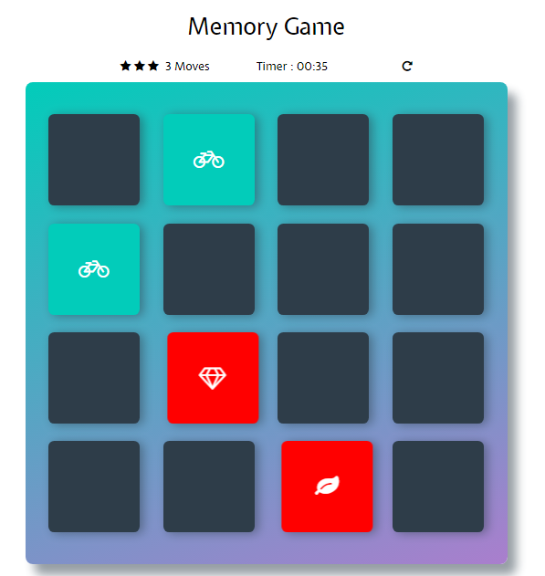

# Memory Game Project

## What is the Memory Game
This is a simple game built to test your memory. There's a card box with different cards. 

## Challenge
Match the cards in minimum moves and time.

## How to Play
Load this link in your browser https://ujjawalponia.github.io/memory-game

## Instructions
* Click on the card.
* Keep click on cards and revealing them to test your memory and try to remember each revealed card.
* Match the cards correctly with minimum moves and time.

## How I built the Memory Game
* Created a card box of cards that shuffles the cards when the game when user click on refresh icon.
* Created a move counter to count the number of moves made by player and timer to record the user time for results.
* Added effects to cards when they matched and are unmatched.
* Created a winner box, to show the results in how much time or moves the user completed the game.

## Follow Me On Social Media
* https://www.facebook.com/ujjawalponia
* https://twitter.com/pooniaujjawal
* https://in.linkedin.com/in/ujjawal-poonia-857b86121
* https://www.instagram.com/pooniaujjawal/
